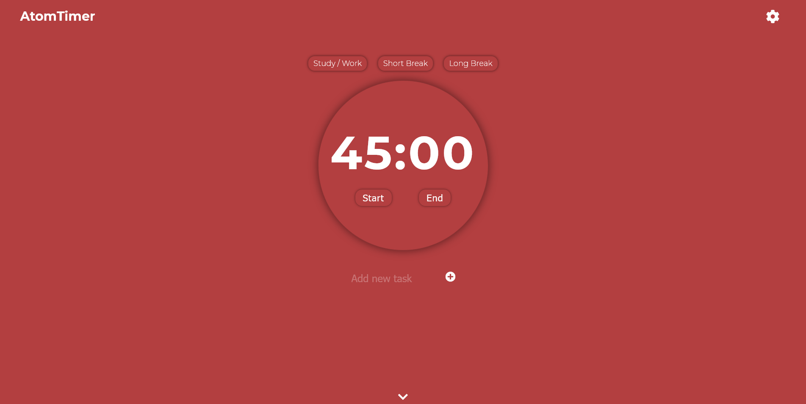
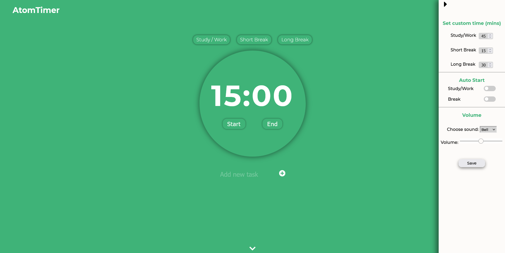

# Productivity Timer App (AtomTimer)
AtomTimer is an app created in order to help you work / study more efficiently. It is inspired by various studying techniques and helps you implement them into your studying or working sessions. It mainly focuses on spaced repetition, high intensity sessions and working on specific tasks. This app aims to boost your efficiency and help you make the most of your working / studying time.

## Screenshot

